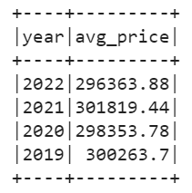
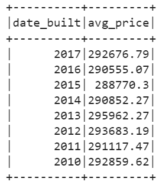
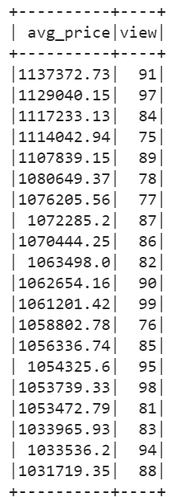

# Home Sales

## Description
This project focuses on utilizing SparkSQL to extract vital metrics from home sales data. The primary objectives include creating temporary views, partitioning data, caching and uncaching a temporary table. 

The ultimate goal is to ensure optimized data operations and improved performance.

## Technologies Used
- SparkSQL
- PySpark

## Data Source
https://2u-data-curriculum-team.s3.amazonaws.com/dataviz-classroom/v1.2/22-big-data/home_sales_revised.csv

## Instructions
Run 'Home_Sales.ipynb' notebook in Google Colab (https://colab.research.google.com/).

May require updating spark_version.

## Data Analysis and Runtime Optimization Steps
Spark was used to 
- create temporary views, 
- partition the data, 
- cache and uncache a temporary table, and 
- verify that the table has been uncached.

The runtime to run a query using cached, uncached and partitioned data was measure. 

Examples of the questions answered:

- What is the average price for a four-bedroom house sold for each year?

- What is the average price of a home for each year it was built that has three bedrooms and three bathrooms?

- What is the "view" rating for homes costing more than or equal to $350,000?.

## Conclusion

    